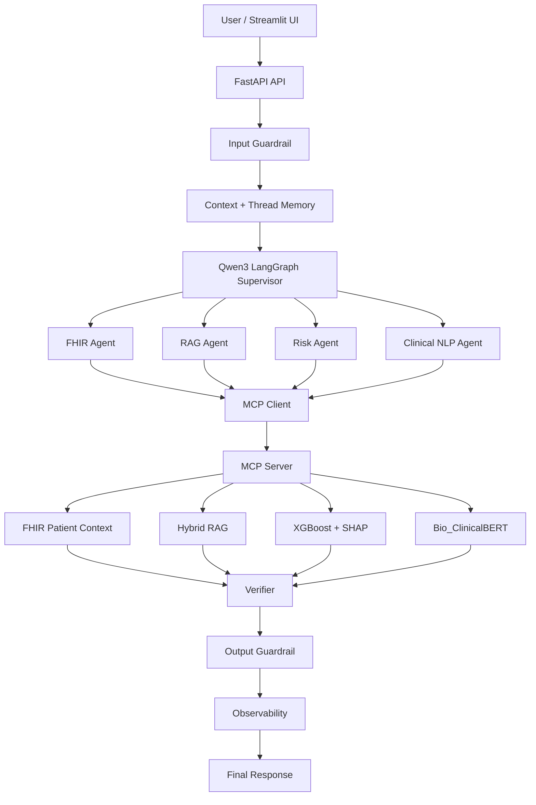

# ClinicalOps AI — Multi-Agent Healthcare Intelligence Platform

ClinicalOps AI is a local-first, production-style AI engineering platform that demonstrates how multi-agent orchestration, retrieval-augmented generation, healthcare interoperability, predictive machine learning, clinical NLP, safety guardrails, observability, and Model Context Protocol tooling can be combined into one end-to-end system.

The platform runs locally with open-source technologies and Ollama-hosted language models, avoiding paid LLM APIs and cloud infrastructure.

> **Important:** This project uses synthetic educational healthcare data and synthetic machine-learning examples. It is not clinically validated and is not intended for diagnosis, treatment, or patient-care decisions.

---

## Platform Highlights

- LangGraph multi-agent orchestration
- Qwen3 local LLM supervisor
- Model Context Protocol (MCP) tool integration
- Streamable HTTP MCP transport
- Hybrid healthcare RAG
- BM25 + FAISS semantic retrieval
- Reciprocal Rank Fusion
- CrossEncoder reranking
- Synthetic FHIR healthcare records
- XGBoost readmission-risk modeling
- SHAP model explanations
- Bio_ClinicalBERT semantic clinical NLP
- Input and output AI guardrails
- Thread-scoped conversational memory
- Runtime observability and privacy-conscious traces
- FastAPI REST APIs
- Streamlit user interface
- Docker and Docker Compose
- Automated pytest suite
- GitHub Actions continuous integration

---

## Architecture



---

## Multi-Agent System

ClinicalOps AI uses LangGraph to coordinate specialized AI agents.

| Agent | Responsibility | MCP Tool |
|---|---|---|
| FHIR Agent | Retrieve grounded synthetic patient context | `get_patient_context` |
| RAG Agent | Search healthcare knowledge and generate grounded answers | `search_healthcare_knowledge` |
| Risk Agent | Run synthetic readmission-risk prediction and SHAP explanation | `predict_readmission_risk` |
| Clinical NLP Agent | Identify semantic clinical patterns | `analyze_clinical_note` |

A Qwen3 supervisor determines the appropriate route based on the user request and available structured inputs.

---

## Model Context Protocol

Domain capabilities are exposed through an MCP server using Streamable HTTP.

Available MCP tools:

- `get_patient_context`
- `search_healthcare_knowledge`
- `predict_readmission_risk`
- `analyze_clinical_note`

The specialist agents call these capabilities through an MCP client instead of accessing the underlying implementation services directly.

---

## Hybrid Healthcare RAG

The retrieval pipeline combines:

- BM25 lexical search
- FAISS semantic vector search
- SentenceTransformer embeddings
- Reciprocal Rank Fusion
- CrossEncoder reranking
- Evidence relevance gating
- Grounded local LLM generation

```text
Question
   |
   +--> BM25 Keyword Search
   |
   +--> FAISS Semantic Search
            |
            v
    Reciprocal Rank Fusion
            |
            v
     CrossEncoder Reranker
            |
            v
       Relevance Gate
            |
            v
      Grounded Generation
```

Queries without sufficient healthcare evidence can be rejected before generation.

---

## Synthetic FHIR Data

The platform includes synthetic healthcare records modeled with FHIR-style resources.

Supported resource types include:

- Patient
- Condition
- Observation
- MedicationRequest
- Encounter

FHIR workflows support retrieval of synthetic patient medications, conditions, observations, encounters, and consolidated patient context.

No real patient data is included in the project.

---

## Predictive Machine Learning

ClinicalOps AI includes an XGBoost demonstration model for synthetic 30-day readmission risk.

Example features include:

- Age
- Prior admissions
- Length of stay
- Chronic-condition count
- Medication count
- Recent emergency visit
- HbA1c
- Systolic blood pressure
- eGFR
- Follow-up days

SHAP TreeExplainer provides feature-level explanations for individual predictions.

The model is trained on synthetic data and is not clinically validated.

---

## Clinical NLP

Clinical NLP uses Bio_ClinicalBERT semantic representations combined with keyword evidence.

Example patterns include:

- Heart failure
- Diabetes
- Renal impairment
- COPD
- Asthma
- Obesity

The resulting scores represent semantic pattern matches and keyword evidence. They are not diagnoses or clinical confidence scores.

---

## AI Guardrails

The platform includes deterministic safety checks before and after agent execution.

### Input Guardrails

Examples include detection of:

- Prompt injection
- System-prompt extraction attempts
- Guardrail-bypass requests
- Direct medication or treatment requests
- Email-like identifiers
- SSN-like identifiers

Blocked requests stop before LLM routing or MCP tool execution.

### Output Guardrails

Outputs are checked for:

- Unsupported clinical directives
- Ungrounded RAG generation
- Missing retrieved evidence
- Missing synthetic-model disclaimers
- Missing clinical-NLP safety language

The identifier checks are lightweight portfolio safeguards and are not a complete HIPAA de-identification system.

---

## Observability

ClinicalOps AI records privacy-conscious JSONL execution traces.

Captured metadata includes:

- Request ID
- Thread ID
- Execution status
- Selected route
- Selected agent
- MCP tool
- Guardrail result
- Verification result
- Memory turns
- Request latency

The observability layer intentionally does not log:

- User questions
- Clinical notes
- Patient payloads
- Risk-feature values

Runtime metrics include request volume, completion rate, route distribution, MCP tool usage, guardrail blocks, verifier pass rate, and latency statistics.


---

## Evaluation

The platform includes a controlled 12-case end-to-end evaluation suite covering:

- Agent routing
- Agent selection
- Input guardrails
- Output guardrails
- MCP tool selection
- Verifier behavior
- Retrieval relevance
- RAG ranking
- Clinical NLP ranking
- Risk classification

Current controlled evaluation result:

```text
HTTP success rate:              100%
End-to-end pass rate:           100%

Routing accuracy:               12/12
Agent selection accuracy:       12/12
Guardrail decision accuracy:    12/12
Input guardrail accuracy:       12/12
Output guardrail accuracy:       9/9
Verifier accuracy:              12/12
MCP tool accuracy:               9/9
Retrieval relevance accuracy:    3/3
RAG Top-1 accuracy:              2/2
Clinical NLP Top-1 accuracy:     2/2
Risk classification accuracy:    2/2
```

These results represent a controlled portfolio evaluation suite and should not be interpreted as clinical accuracy.

---

## Automated Tests

The repository includes deterministic pytest coverage for:

- Context and memory behavior
- Input guardrails
- Output guardrails
- Verifier behavior

Current local result:

```text
15 passed
```

These tests run without requiring Ollama or large model downloads.

---

## Continuous Integration

GitHub Actions runs automatically on pushes and pull requests to `main`.

The CI workflow performs:

```text
Repository Push / Pull Request
        |
        +--> Python 3.13 setup
        |
        +--> Lightweight CI dependencies
        |
        +--> Python syntax validation
        |
        +--> 15 deterministic pytest tests
        |
        +--> Docker Compose validation
```

The heavier end-to-end evaluation remains a local integration benchmark because it depends on local LLM and ML runtime components.

---

## Streamlit UI

The Streamlit application provides workflows for:

1. Healthcare Knowledge / RAG
2. FHIR Patient Record
3. Readmission Risk
4. Clinical NLP
5. Guardrail Testing

Additional views expose:

- Runtime observability
- Route distribution
- MCP tool usage
- Privacy controls
- Recent traces
- Platform architecture

---

## Key API Endpoints

```text
GET  /health

POST /api/v1/agents/run
GET  /api/v1/agents/status
GET  /api/v1/agents/metrics
GET  /api/v1/agents/traces/recent

GET  /api/v1/fhir/patients/{patient_id}
GET  /api/v1/fhir/patients/{patient_id}/context

POST /api/v1/knowledge/search

POST /mcp
```

FastAPI interactive documentation is available locally at:

```text
http://localhost:8000/docs
```

---

## Technology Stack

### Agentic AI

- LangGraph
- LangChain
- Ollama
- Qwen3
- Model Context Protocol

### Retrieval

- FAISS
- BM25
- SentenceTransformers
- CrossEncoder
- Reciprocal Rank Fusion

### Machine Learning

- XGBoost
- SHAP
- Scikit-learn

### Clinical NLP

- Hugging Face Transformers
- Bio_ClinicalBERT
- PyTorch

### Backend

- Python
- FastAPI
- Pydantic
- HTTPX
- Uvicorn

### UI

- Streamlit

### Platform Engineering

- Docker
- Docker Compose
- pytest
- GitHub Actions

---

## Running Locally

### Requirements

- Python 3.13+
- Ollama
- `qwen3:4b`

Create and activate a virtual environment:

```bash
python -m venv .venv
source .venv/bin/activate
python -m pip install -r requirements.txt
```

Start the backend:

```bash
OMP_NUM_THREADS=1 uvicorn app.main:app
```

Start Streamlit in another terminal:

```bash
source .venv/bin/activate
python -m streamlit run ui/streamlit_app.py
```

Local services:

```text
FastAPI:    http://localhost:8000
Streamlit:  http://localhost:8501
```

---

## Running with Docker Compose

Ollama runs on the Mac host while FastAPI and Streamlit run in Docker containers.

Build and start:

```bash
docker compose build
docker compose up
```

Docker Desktop uses:

```text
host.docker.internal
```

so the API container can reach Ollama running on the host.

Stop the platform with:

```bash
docker compose down
```

---

## Testing

Run deterministic unit tests:

```bash
python -m pytest -v
```

Run the controlled end-to-end evaluation while FastAPI is running:

```bash
OMP_NUM_THREADS=1 python scripts/evaluate_agents.py
```

The evaluation report is written to:

```text
reports/phase11_evaluation.json
```

---

## Project Structure

```text
ClinicalOps-AI-MultiAgent-Platform/
|
├── app/
│   ├── agents/
│   ├── api/
│   ├── core/
│   ├── guardrails/
│   ├── ml/
│   ├── nlp/
│   ├── rag/
│   ├── schemas/
│   ├── services/
│   ├── main.py
│   └── mcp_server.py
│
├── data/
│   ├── evaluation/
│   ├── fhir/
│   └── knowledge/
│
├── reports/
│   └── phase11_evaluation.json
│
├── scripts/
│   ├── evaluate_agents.py
│   ├── generate_risk_data.py
│   ├── train_risk_model.py
│   ├── test_clinicalbert.py
│   ├── test_mcp_http.py
│   └── test_mcp_tools.py
│
├── tests/
│   ├── test_context.py
│   ├── test_guardrails.py
│   └── test_verifier.py
│
├── ui/
│   └── streamlit_app.py
│
├── .github/workflows/
│   └── ci.yml
│
├── Dockerfile
├── Dockerfile.ui
├── docker-compose.yml
├── pytest.ini
├── requirements.txt
├── requirements-ci.txt
└── requirements-ui.txt
```

---

## Privacy and Safety

ClinicalOps AI is intentionally designed as a portfolio and educational platform.

- Only synthetic healthcare examples should be used.
- No real patient information should be committed.
- Runtime traces avoid storing clinical payload content.
- Predictive outputs are not clinically validated.
- ClinicalBERT matches are not diagnoses.
- RAG answers are intended to remain grounded in retrieved evidence.
- The platform is not intended for production patient-care use.

---

## Engineering Objectives Demonstrated

This project demonstrates practical experience with:

- Agentic AI architecture
- Multi-agent orchestration
- Tool-calling systems
- Model Context Protocol
- Retrieval engineering
- Hybrid search and reranking
- Healthcare interoperability
- Machine-learning inference
- Explainable AI
- Transformer-based NLP
- AI guardrails
- LLM evaluation
- AI observability
- API engineering
- Containerization
- Continuous integration
- Local LLM deployment

---

## Version

**0.2.0 — Portfolio Platform Release**
